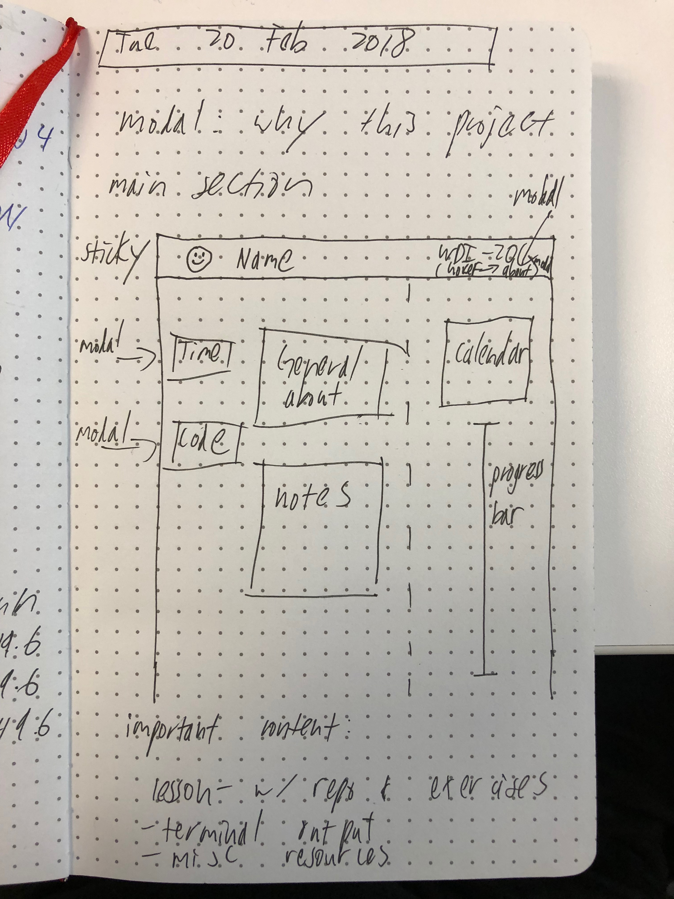

# WDI - A Case Study

## Motivation

During WDI, consistently kept track of my time and output. I have CSV timesheets that measure how much time I spent in class, on assignments, on MVP and Bonus features, and beyond. I saved a majority of my terminal outputs as GISTs. And there are the repos of my work, of course.

I want to make a site that visualizes this data, and not only to illustrate my journey, but also to take a look back and identify things that worked for me and areas I can improve upon.

## Approach

For the Front End, I plan on using Vue. This is a new technology for me, but with some preliminary research (and their excellent documentation) I feel comfortable with my MVP goals.

### Mockup

There's a sticky header, that has my picture, name, and a link to a modal popup for the "about" information of the project.

The main section has information about a given day in WDI. I want a breakdown of my time spent, and my code/gists at the minimum. I think for some days, or even at the start of a week, I can have a note about what that day/week was like for me. I think that there should also be some icons to break out more information as a slide-in window or some other sort of modal.

I plan on having an infinite scroll-like user experience, where the page starts at day one and the user scrolls down and seamlessly sees the next day. The URL should change and reflect the given day. As a bonus, I want to use local storage to keep track of where the user is if they close out of the page.

The pièce de résistance is the calendar. I want it directly tied to the given day, and allow a user to navigate to a given day. The calendar plugin I found looks very powerful, but at the very least I want it to accurately update the highlighted day as the use scrolls through the main content.

I also included a vertical progress bar, that I can subdivide into weeks as well. That's less important, but I think a reasonable feature to reach for.

### Vue Plugins of note

- [v-calendar](https://github.com/nathanreyes/v-calendar)
- [vue-infinite-scroll](https://github.com/ElemeFE/vue-infinite-scroll)
- [sweet-modal-vue](https://github.com/adeptoas/sweet-modal-vue)
- [vue-markdown](https://github.com/miaolz123/vue-markdown)

## Considerations

- How much time I spent, and on what
  - MVP vs Bonus time breakdown
  - Especially difficult HW/Labs
  - How to I represent weekends and holidays? Outcomes work?
- Repos
  - exercises
  - lessons? I would have to make the links go to private repos, or find some other way to gate them, because I can't just post GA course materials.
  - Gists of terminal outputs
- Noteworthy links (actually, this might be a whole other section by itself)

## Deadlines

1. [ ] I need to make sure Vue is behaving how I want. So, I need to make the components and use test data first. EOD Tuesday is the hard deadline for this.
2. [ ] Get the data. I have a lot of CSVs to export, and I have to go through my Gists and repos and curate a list of links. I plan on implementing the first week of data first, then getting the rest of the data after.
3. [ ] All this data needs to go into some sort of format to be consumed by the components. Markdown would be great, but there might be a better approach.

## Checklist

- [ ] make a header
- [ ] make sidebar
  - [ ] calendar
  - [ ] progress bar (12 weeks)
- [ ] make scroll change calendar and progress bar

- [ ] implement fullpage
- [ ] implement v-calendar
- [ ] have components change on navigation
- [ ] implement modal for 'about'
